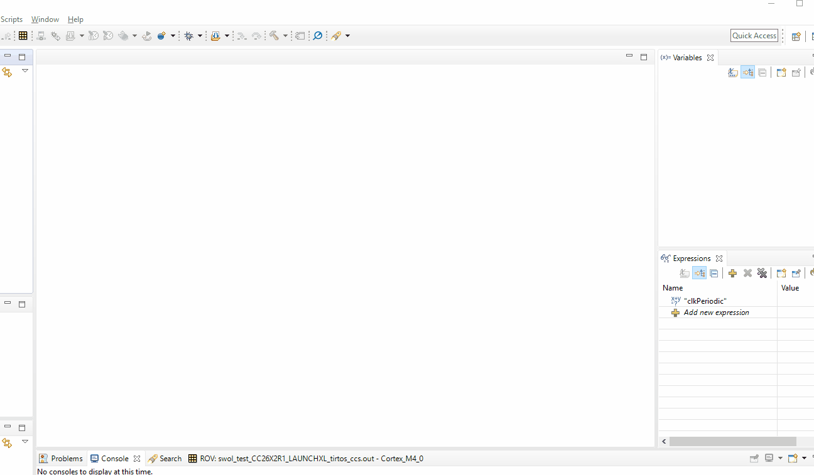
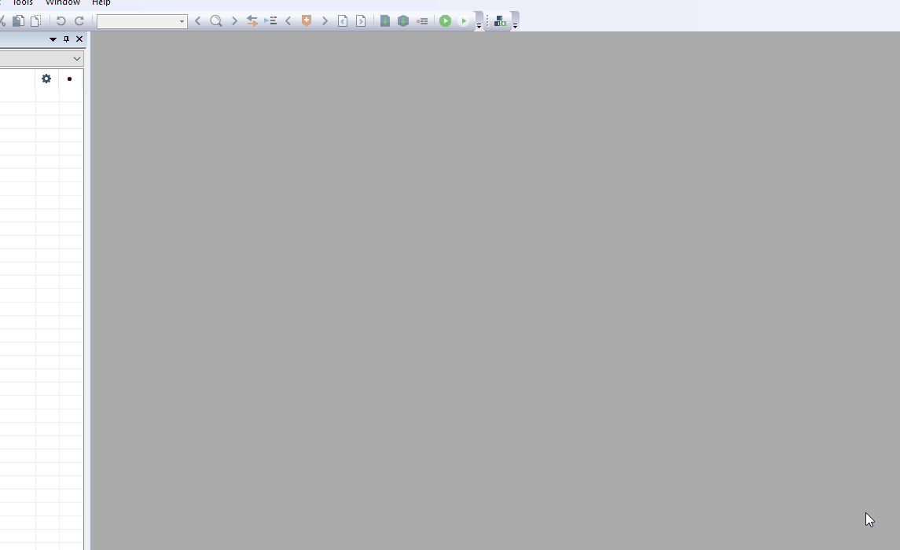
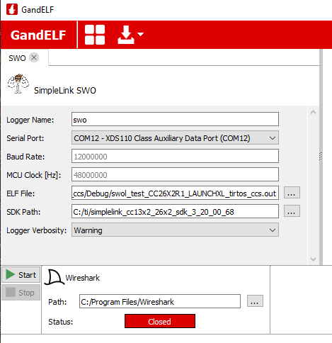
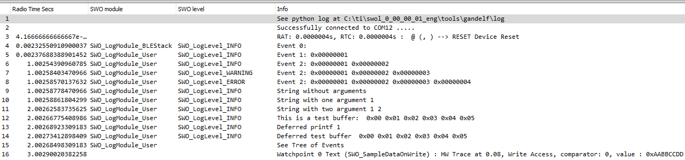

# Single Wire Output Logger (SWOL)

# Moved from https://github.com/ti-simplelink/swol


SWOL is an ecosystem to provide extensive, flexible, yet minimally invasive debug information using
the ARM ITM module on Texas Instruments (TI) CC13x2 / CC26xx devices. The debug information is
 then parsed with Python and outputted / viewed using Wireshark.

## Overview

The ecosystem consists of the following parts, which are expanded upon in sections below:
* **SWO Driver**: An embedded driver to send various debug output (formatted text, data dumps,
   etc) through a single-wire serial interface. For documentation on this, see the
   [Doxygen](./swol/html/index.html) ***only after completing the Quick-Start demo here***
* **Logger**: Python code to parse .elf file, receive and parse seral data, build into high-level
   frames, and send to Wireshark. For documentation on this, see TODO
* A basic Wireshark dissector to display frames and timing in Wireshark
* **Gandelf**: A GUI configuration tool (Gandelf) provided as an executable to set input files,
  settings, and manage the pipe between Python and Wireshark.

## Environment Setup

These instructions will detail how to get a SWOL Test project running on your local machine for
development and testing purposes.

Currently, this has only been tested on Windows 10. It theoretically should work on all operating
systems but you are on your own to verify this. There are most likely bugs. Testing for other
operating systems is planned for future work.

### Hardware Prerequisites

* A development board that includes XDS-110 such as the
[CC26X2R Launchpad](http://dev.ti.com/tirex/explore/node?node=AJ43pE6nKn8za7wNS.b7NQ__FUz-xrs__LATEST).
**Ensure that the SWO jumper is attached**:


### Software Prerequisites
* A TI Software Development Kit (SDK) for the appropriate hardware. Supported versions are:
    * [SimpleLink™ CC13x2 and CC26x2 software development kit](http://www.ti.com/tool/SIMPLELINK-CC13X2-26X2-SDK) (>= v3.20.00.xx)
    * [SimpleLink™ CC2640R2 SDK](http://www.ti.com/tool/SIMPLELINK-CC2640R2-SDK) (>= v3.20.00.xx)
* An IDE (Code Composer Studio or IAR) as stated in the release_notes_xxx.html file included at
  the top directory of the above SDK
* [Wireshark](https://www.wireshark.org/download.html) (>= 3.0.2)

### Installing
This assumes that the above prerequisites are already installed.

1. The SWOL plugin is not currently provided as an installer. Therefore, it is necessary to copy
   the entire swol_x_xx_xx_xx directory into C:/ti. Do this first. This location will henceforth be
   referred to as $SWO_PLUGIN_INSTALL$
1. Add the SWOL dissector to the Wireshark plugins directory.
    1. Find the plugins directory specific to the Wireshark installation. In Wireshark, goto
        Help->About Wireshark and select the Folders tab. Take note of the "Global Plugins" folder
    1. Copy the swol_tools/swo_logger_tools/logger/dissector/wireshark_dissectors/swol_dissector.lua
       file into the "Global Plugins" folder from the previous step

## Quick-Start Logging Demo

The plugin comes with a ```swo_test``` embedded project that demonstrates all possible SWO commands
and some module parsing. Run this demo first to verify that the environment is setup correctly. To
run this demo:

1. Compile and download the swo_test project. See below for IDE-specific instructions
    - CCS:
        1. Open the project in CCS from $SWO_PLUGIN_INSTALL$/examples/rtos/ in the appropriate
           board folder
        1. Install the SWO plugin. Go to Window->Preferences->Code Composer Studio->Products and
           add $SWO_PLUGIN_INSTALL$ to the "Product Discovery Paths"
        
        1. Compile and download the project
    - IAR:
        1. Set the global argvars. Go to Tools->Configure Custom Argument Variables and import,
           as a global argvar, $SWO_PLUGIN_INSTALL$/tools/iar/swol_xxxx.custom_argvars for the
           appropriate board.
        
        1. Open the project in IAR from $SWO_PLUGIN_INSTALL$/examples/rtos/ in the appropriate
           board folder
        1. Compile and download the project
1. Run $SWO_PLUGIN_INSTALL$/tools/gandelf/gandelf.exe to open the configuration tool
1. Set the path to the top-level Wireshark directory.
1. Click the icon to add a logger, choose SWO, and configure, pointing to the appropriate
   files and ports:

    

    These options are the parameters that are passed into ```logger.exe```. So for more
    information on any option, run the following from your terminal of choice:

    ```
    logger.exe -h
    ```
1. Click start. This will open Wireshark, start the logger, and create a pipe between the
   two.
1. Once the Wireshark output says "Connected to COMXX", reset the device to start logging.
   The output should look something like this:

    

## Using SWOL

### Using Pre-existing Modules

Now that the demo is running, and thus the environment setup has been verified, SWOL can be
added to an existing project. All of the necessary information to accomplish this can be found
in the "Usage" section of the ```SWO.h``` [API Documentation](./swol/html/index.html)

### Adding a Custom Module

TODO

## Using Python Source Logger

By default, Gandelf is configured to use a pre-compiled Logger executable. This is sufficient
if it is only desired to use the built-in Logger modules. If it is desired to create a custom
Logger module or modify the Logger in any way, it is required to use the Python source code.
This adds the following software requirements:

* [Python](https://www.python.org/downloads/) (>= 3.7.x)

To use the python source code instead of the executable, perform the following.

1. Install python requirements:
    ```
    pip install -r $SWO_PLUGIN_INSTALL$/tools/logger/pip-requirements.txt
    ```
1. Instruct Gandelf to call ```logger.py``` instead of the executable. This is done by
   setting the SWO "binary" in $SWOL_PLUGIN_INSTALL$/tools/gandelf/loggers/loggers.json
   to point to the executable. Here is an example for Windows:
    ```json
    {
        "id": "swo",
        "project": "SWO",
        "name": "SimpleLink SWO",
        "icon": "loggers/swo/swo.svg",
        "binary": "../logger/logger.py",
    },
    ```
    Note that Gandelf will need to be restarted for this change to take effect.
