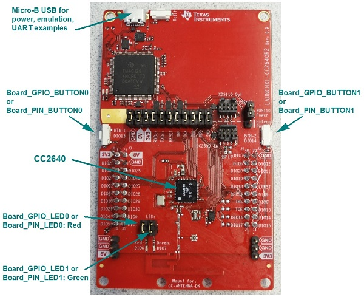

# CC2640R2 SimpleLink LaunchPad Settings & Resources

The CC2640R2 LaunchPad consists of a LaunchPad board with a CC2640R2F device.

## Jumper Settings

* For any examples that use LEDs, make sure the LED's jumper settings are closed.
* Set __RXD &lt;&lt;__ and __TXD &gt;&gt;__ to provide UART communication via the onboard USB debugger.
* If you use a BoosterPack with this board, the BoosterPack fits over J1 and J2.

## Board resources used in driver examples

The following table lists the Board names of the resources used by
the driver examples, and their corresponding pins.  Note that there may be
other resources configured in the board files that are not used by any
driver example.  Only the example resources are listed in the table.

  |Board Resource|Pin|
  |--------------|:---|
  |`Board_ADC0`|DIO23|
  |`Board_ADC1`|DIO24|
  |`Board_ADCBUF0CHANNEL0`|DIO23|
  |`Board_GPIO_BUTTON0`|DIO13 (BTN-1)|
  |`Board_GPIO_BUTTON1`|DIO14 (BTN-2)|
  |`Board_GPIO_LED0`|DIO6  (Red LED must be jumpered)|
  |`Board_GPIO_LED1`|DIO7  (Green LED must be jumpered)|
  |`Board_I2C_TMP`|DIO4 - `SCL`, DIO5 - `SDA`|
  |`Board_PIN_LED0`|DIO6  (Red LED must be jumpered)|
  |`Board_PIN_LED1`|DIO7  (Green LED must be jumpered)|
  |`Board_PIN_LED2`|DIO6  (Red LED must be jumpered)|
  |`Board_PWM0`|DIO6|
  |`Board_PWM1`|DIO7|
  |`Board_SD0`|DIO8 - `MISO`, DIO9 - `MOSI`, DIO10 - `CLK`, DIO21 - `CS`|
  |`Board_SPI0`|DIO8 - `MISO`, DIO9 - `MOSI`, DIO10 - `CLK`, DIO11 - `CS`|
  |`Board_SPI_MASTER`|DIO8 - `MISO`, DIO9 - `MOSI`, DIO10 - `CLK`, DIO11 - `CS`|
  |`Board_SPI_SLAVE`|DIO8 - `MISO`, DIO9 - `MOSI`, DIO10 - `CLK`, DIO11 - `CS`|
  |`Board_SPI_MASTER_READY`|DIO15|
  |`Board_SPI_SLAVE_READY`|DIO21|
  |`Board_UART0`|DIO3 - `TX`, DIO2 - `RX`  (UART provided through emulation, __RXD &lt;&lt;__ and __TXD &gt;&gt;__ must be jumpered)|

## BoosterPacks

The following examples require BoosterPacks.

  |Example|BoosterPack|
  |-------|:------------|
  |display|[BOOSTXL-SHARP128 LCD & SDCard BoosterPack](http://www.ti.com/tool/boostxl-sharp128)|
  |i2ctmp116|[BOOSTXL-BASSENSORS BoosterPack](http://www.ti.com/tool/BOOSTXL-BASSENSORS)|
  |portable|[BOOSTXL-BASSENSORS BoosterPack](http://www.ti.com/tool/BOOSTXL-BASSENSORS)|
  |sdraw|[BOOSTXL-SHARP128 LCD & SDCard BoosterPack](http://www.ti.com/tool/boostxl-sharp128)|

## Peripherals Used

The following list shows which CC2640R2_LAUNCHXL peripherals are used by
driver and kernel applications. Driver examples control which peripherals (and which ports) are used.

* __TI-RTOS Kernel (SYS/BIOS)__
    * Uses the CC26xx's RTC timer and that timer's associated interrupts. The TI-RTOS Kernel manages the Interrupt Vector Table.
* __TI-RTOS Drivers__
    * __ADC:__ A CC13xx/CC26xx specific driver that uses the onboard ADC peripheral.
    * __Crypto:__ A CC13xx/CC26xx specific driver that uses the onboard AES Crypto processor.
    * __GPIO:__ The GPIO driver is used in various examples to drive `Board_GPIO_LED0` and `Board_GPIO_LED1`, and to monitor the `Board_GPIO_BUTTON0` and `Board_GPIO_BUTTON1` buttons.
    * __I2C:__ The I2C driver is used to manage the`Board_I2C0` I2C instance.
    * __NVS:__ The `Board_NVSINTERNAL` region uses on-chip flash memory. This NVS region is defined in the example application's board file.
    * __NVS SPI:__ The `Board_NVSEXTERNAL` region uses off-chip SPI flash memory. This NVS region is defined in the example application's board file.
    * __PIN:__ A CC13xx/CC26xx specific driver PIN driver that uses 1 output pin for the onboard `Board_PIN_LED0` and `Board_PIN_LED1`, and 2 input pins for buttons `Board_PIN_BUTTON0` and `Board_PIN_BUTTON1`.
    * __RF:__ The RF driver uses the on-chip radio module on CC26xx devices.
    * __SD:__ The SD driver is built on the GPIO and SPI drivers to communicate with an SD card via SPI.  `Board_SD0` uses `Board_SPI0` to send data to-and-from the SD card.
    * __SPI:__ The SPI driver uses SPI0 for `Board_SPI0` SPI instance.
    * __UART:__ The UART driver uses UART0, which is attached to the onboard emulator to facilitate serial communications.
    * __Watchdog:__ The Watchdog driver example uses the Watchdog Timer WDT peripheral (`Board_WATCHDOG0`).
